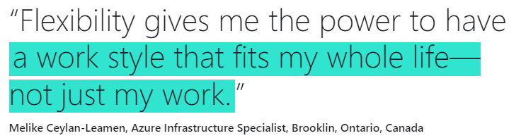

---
# https://github.com/chrisrhymes/bulma-clean-theme
#
layout: page
title: Judging Criteria
subtitle: How we will judge your contributions
menubar: menu
---

## Jury criteria

As with all great hack projects, our jury will evaluate your contributions along the following criteria:

- **Creativity and Novelty**: Did you come up with some an creative and innovative and new ideas ?
- **Technical Feasibility**: Did you manage to demonstrate your tech skills and technical feasibibility by implementing a working prototype ?
- **Pitch and Clarity of Vision**: Did you do a well-rounded pitch, where non-technical stakeholders got excited about your project?

